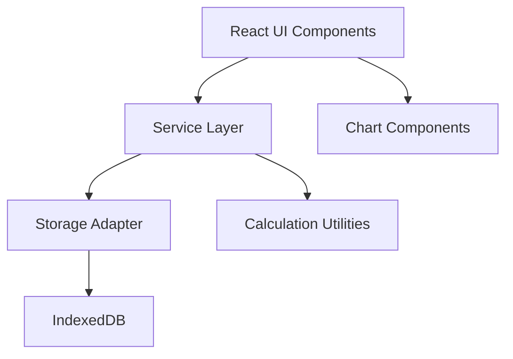

# Design Document

## Overview

The Personal Finance Tracker is a single-page application (SPA) built with React and TypeScript that runs entirely in the browser. It uses IndexedDB for local data persistence, ensuring privacy and offline functionality. The application follows a layered architecture with clear separation between UI components, business logic, and data access layers.

## Architecture

### High-Level Architecture



### Technology Stack

- **Frontend Framework**: React 18+ with Vite for fast development and optimized builds
- **Language**: TypeScript for type safety and better developer experience
- **Styling**: Tailwind CSS for responsive, utility-first styling
- **Data Visualization**: Recharts (React-friendly, TypeScript support, tree-shakeable)
- **Storage**: idb library (Promise-based IndexedDB wrapper)
- **Testing**: Vitest for unit tests, Playwright for E2E tests
- **Build Tool**: Vite for fast builds and HMR

### Project Structure

```
src/
├── components/
│   ├── dashboard/
│   │   ├── Dashboard.tsx
│   │   ├── BalanceCard.tsx
│   │   ├── MonthlySpendingCard.tsx
│   │   ├── CategoryPieChart.tsx
│   │   └── SpendingLineChart.tsx
│   ├── transactions/
│   │   ├── TransactionList.tsx
│   │   ├── TransactionForm.tsx
│   │   └── TransactionItem.tsx
│   ├── budgets/
│   │   ├── BudgetList.tsx
│   │   ├── BudgetForm.tsx
│   │   └── BudgetItem.tsx
│   ├── settings/
│   │   ├── Settings.tsx
│   │   ├── ImportCSV.tsx
│   │   └── ExportCSV.tsx
│   └── common/
│       ├── Layout.tsx
│       ├── Navigation.tsx
│       └── ConfirmDialog.tsx
├── services/
│   ├── transactionService.ts
│   ├── budgetService.ts
│   └── calculationService.ts
├── storage/
│   └── indexeddb.ts
├── types/
│   └── index.ts
├── utils/
│   ├── csv.ts
│   ├── dateUtils.ts
│   └── formatters.ts
├── App.tsx
└── main.tsx
```

## Components and Interfaces

### Data Models

```typescript
// types/index.ts

export interface Transaction {
  id: string;
  date: string; // ISO 8601 format (YYYY-MM-DD)
  amount: number; // Positive for income, negative for expenses
  category: string;
  notes?: string;
}

export interface Budget {
  id: string;
  month: string; // Format: YYYY-MM
  category: string;
  limit: number; // Positive number
}

export interface BudgetWithRemaining extends Budget {
  spent: number;
  remaining: number;
}

export interface CategoryTotal {
  category: string;
  total: number;
}

export interface SpendingOverTime {
  date: string;
  amount: number;
}
```

### Storage Layer

The storage layer provides a clean abstraction over IndexedDB operations.

```typescript
// storage/indexeddb.ts

export interface StorageAdapter<T> {
  add(item: Omit<T, 'id'>): Promise<string>;
  getAll(): Promise<T[]>;
  getById(id: string): Promise<T | undefined>;
  update(id: string, item: Partial<T>): Promise<void>;
  delete(id: string): Promise<void>;
}

export class IndexedDBAdapter<T extends { id: string }> implements StorageAdapter<T> {
  constructor(
    private dbName: string,
    private storeName: string,
    private version: number = 1
  ) {}
  
  // Implementation details...
}

// Factory functions for specific entities
export const createTransactionStorage = (): StorageAdapter<Transaction> => {
  return new IndexedDBAdapter<Transaction>('finance-tracker', 'transactions', 1);
};

export const createBudgetStorage = (): StorageAdapter<Budget> => {
  return new IndexedDBAdapter<Budget>('finance-tracker', 'budgets', 1);
};
```

**Design Decisions:**
- Use generic `StorageAdapter` interface to allow future storage implementations
- Use `idb` library for cleaner Promise-based API over raw IndexedDB
- Single database with multiple object stores (transactions, budgets)
- Generate UUIDs for entity IDs to avoid collision issues

### Service Layer

Services encapsulate business logic and coordinate between storage and UI.

```typescript
// services/transactionService.ts

export class TransactionService {
  constructor(private storage: StorageAdapter<Transaction>) {}
  
  async addTransaction(data: Omit<Transaction, 'id'>): Promise<Transaction>;
  async updateTransaction(id: string, data: Partial<Transaction>): Promise<void>;
  async deleteTransaction(id: string): Promise<void>;
  async getAllTransactions(): Promise<Transaction[]>;
  async getTransactionsByMonth(month: string): Promise<Transaction[]>;
  async getTransactionsByCategory(category: string): Promise<Transaction[]>;
}

// services/budgetService.ts

export class BudgetService {
  constructor(
    private budgetStorage: StorageAdapter<Budget>,
    private transactionService: TransactionService
  ) {}
  
  async addBudget(data: Omit<Budget, 'id'>): Promise<Budget>;
  async updateBudget(id: string, data: Partial<Budget>): Promise<void>;
  async deleteBudget(id: string): Promise<void>;
  async getAllBudgets(): Promise<Budget[]>;
  async getBudgetWithRemaining(id: string): Promise<BudgetWithRemaining>;
  async getAllBudgetsWithRemaining(): Promise<BudgetWithRemaining[]>;
}

// services/calculationService.ts

export class CalculationService {
  calculateTotalBalance(transactions: Transaction[]): number;
  calculateMonthlySpending(transactions: Transaction[], month: string): number;
  calculateCategoryTotals(transactions: Transaction[]): CategoryTotal[];
  calculateSpendingOverTime(transactions: Transaction[], groupBy: 'day' | 'week' | 'month'): SpendingOverTime[];
  calculateBudgetRemaining(budget: Budget, transactions: Transaction[]): number;
}
```

**Design Decisions:**
- Services are instantiated with dependencies (dependency injection pattern)
- Calculation logic is separated into its own service for testability
- Services return domain objects, not raw storage data
- All async operations return Promises for consistent error handling

### UI Components

#### Dashboard Components

**Dashboard.tsx**: Main container that orchestrates data fetching and passes to child components.

**BalanceCard.tsx**: Displays total balance with formatting.

**MonthlySpendingCard.tsx**: Shows current month spending.

**CategoryPieChart.tsx**: Recharts pie chart showing category distribution.
- Uses `PieChart`, `Pie`, `Cell`, `Legend`, `Tooltip` from Recharts
- Color palette defined in theme
- Responsive sizing

**SpendingLineChart.tsx**: Recharts line chart showing spending trends.
- Uses `LineChart`, `Line`, `XAxis`, `YAxis`, `CartesianGrid`, `Tooltip` from Recharts
- Configurable time grouping (daily/weekly/monthly)
- Responsive sizing

#### Transaction Components

**TransactionList.tsx**: Displays paginated list of transactions with sort/filter options.

**TransactionForm.tsx**: Form for adding/editing transactions with validation.
- Date picker (HTML5 date input)
- Amount input with validation
- Category dropdown (populated from existing categories + custom entry)
- Optional notes textarea
- Form validation with error messages

**TransactionItem.tsx**: Individual transaction row with edit/delete actions.

#### Budget Components

**BudgetList.tsx**: Displays all budgets with remaining amounts and visual indicators.

**BudgetForm.tsx**: Form for creating/editing budgets.
- Month picker (HTML5 month input)
- Category selection
- Limit amount input with validation

**BudgetItem.tsx**: Individual budget display with progress bar showing spent/remaining.

#### Settings Components

**Settings.tsx**: Container for import/export functionality.

**ImportCSV.tsx**: File input and parsing logic for CSV import.
- File input with accept=".csv"
- Client-side CSV parsing
- Validation and error reporting
- Preview before import

**ExportCSV.tsx**: Buttons to trigger CSV export for transactions and budgets.
- Generate CSV from data
- Trigger browser download

#### Common Components

**Layout.tsx**: Main layout wrapper with navigation and content area.

**Navigation.tsx**: Responsive navigation (hamburger menu on mobile, sidebar on desktop).

**ConfirmDialog.tsx**: Reusable confirmation modal for destructive actions.

### Routing

Use React Router for client-side routing:
- `/` - Dashboard
- `/transactions` - Transaction list and management
- `/budgets` - Budget list and management
- `/settings` - Import/export settings

## Data Models

### IndexedDB Schema

**Database Name**: `finance-tracker`

**Version**: 1

**Object Stores**:

1. **transactions**
   - Key path: `id`
   - Indexes:
     - `date` (for date-based queries)
     - `category` (for category filtering)

2. **budgets**
   - Key path: `id`
   - Indexes:
     - `month` (for month-based queries)
     - `category` (for category filtering)
     - `[month, category]` (compound index for uniqueness check)

### Data Validation

**Transaction Validation**:
- `date`: Required, valid ISO date string
- `amount`: Required, valid number (can be positive or negative)
- `category`: Required, non-empty string, max 50 characters
- `notes`: Optional, max 500 characters

**Budget Validation**:
- `month`: Required, valid YYYY-MM format
- `category`: Required, non-empty string, max 50 characters
- `limit`: Required, positive number

### CSV Format

**Transactions CSV**:
```
date,amount,category,notes
2025-01-15,-45.50,Groceries,Weekly shopping
2025-01-16,2000.00,Income,Salary
```

**Budgets CSV**:
```
month,category,limit
2025-01,Groceries,400.00
2025-01,Entertainment,150.00
```

## Error Handling

### Storage Errors

- **Database initialization failure**: Display error message, suggest browser compatibility check
- **Quota exceeded**: Notify user, suggest exporting data and clearing old records
- **Transaction conflicts**: Retry with exponential backoff
- **Corruption**: Provide option to reset database (with export first)

### Validation Errors

- Display inline validation errors on form fields
- Prevent form submission until all errors are resolved
- Use clear, actionable error messages

### Import Errors

- Parse CSV row-by-row
- Collect all validation errors
- Display summary of successful/failed imports
- Allow user to download error report
- Rollback on critical errors (invalid file format)

### UI Error Boundaries

- Implement React Error Boundaries for component-level error handling
- Display user-friendly error messages
- Provide "retry" or "reset" actions
- Log errors to console for debugging

## Testing Strategy

### Unit Tests (Vitest)

**Storage Layer Tests** (`storage/indexeddb.test.ts`):
- Test CRUD operations for transactions
- Test CRUD operations for budgets
- Test error handling (database not available, quota exceeded)
- Use fake-indexeddb for testing environment

**Service Layer Tests**:
- `transactionService.test.ts`: Test all transaction operations
- `budgetService.test.ts`: Test budget operations and remaining calculations
- `calculationService.test.ts`: Test all calculation functions with various inputs
  - Empty arrays
  - Single items
  - Multiple items
  - Edge cases (zero amounts, negative amounts)

**Utility Tests**:
- `csv.test.ts`: Test CSV parsing and generation
- `dateUtils.test.ts`: Test date formatting and manipulation
- `formatters.test.ts`: Test currency and number formatting

**Component Tests** (optional, focused on logic):
- Test form validation logic
- Test data transformation in components

### E2E Tests (Playwright)

**Critical User Flow**:
1. User opens application
2. User adds a new transaction
3. Transaction appears in transaction list
4. Dashboard updates with new balance
5. User creates a budget
6. Budget appears with correct remaining amount

**Additional E2E Tests** (if time permits):
- Edit and delete transaction flow
- CSV export and import flow
- Mobile responsive behavior

### Test Coverage Goals

- Storage layer: 100% coverage
- Service layer: 95%+ coverage
- Calculation utilities: 100% coverage
- Overall: 80%+ coverage

## Performance Considerations

### Optimization Strategies

1. **Lazy Loading**: Code-split routes using React.lazy()
2. **Memoization**: Use React.memo() for expensive chart components
3. **Debouncing**: Debounce search/filter inputs
4. **Virtual Scrolling**: Implement virtual scrolling for large transaction lists (react-window)
5. **IndexedDB Indexing**: Use indexes for common queries (date, category)
6. **Chart Data Sampling**: Limit data points in charts to prevent performance degradation

### Performance Targets

- Initial load: < 2 seconds
- Transaction add/edit: < 500ms to UI update
- Chart rendering: < 1 second
- CSV export (1000 records): < 2 seconds

## Accessibility

### WCAG 2.1 Level AA Compliance

1. **Keyboard Navigation**:
   - All interactive elements accessible via Tab
   - Modal dialogs trap focus
   - Skip navigation link

2. **Screen Reader Support**:
   - Semantic HTML elements
   - ARIA labels for icons and charts
   - ARIA live regions for dynamic updates
   - Form labels properly associated

3. **Visual Design**:
   - Minimum 4.5:1 contrast ratio for text
   - Focus indicators on all interactive elements
   - No information conveyed by color alone
   - Minimum touch target size: 44x44px

4. **Forms**:
   - Clear error messages
   - Error summary at top of form
   - Required fields indicated
   - Input validation with helpful feedback

## Responsive Design

### Breakpoints (Tailwind defaults)

- Mobile: < 640px
- Tablet: 640px - 1024px
- Desktop: > 1024px

### Mobile Adaptations

- Hamburger menu navigation
- Stacked layout for dashboard cards
- Simplified charts (fewer data points, larger touch targets)
- Bottom sheet for forms
- Swipe gestures for delete actions

### Desktop Enhancements

- Sidebar navigation
- Multi-column dashboard layout
- Larger charts with more detail
- Keyboard shortcuts
- Hover states and tooltips

## Security Considerations

### Data Privacy

- All data stored locally in browser
- No external API calls (except for initial app load)
- No analytics or tracking
- Clear data export for user control

### Input Sanitization

- Sanitize all user inputs before storage
- Prevent XSS through React's built-in escaping
- Validate CSV imports to prevent injection attacks

### Browser Compatibility

- Target modern browsers with IndexedDB support:
  - Chrome 90+
  - Firefox 88+
  - Safari 14+
  - Edge 90+
- Display compatibility warning for unsupported browsers

## Deployment

### Build Configuration

- Vite production build with minification
- Tree-shaking for optimal bundle size
- Asset optimization (images, fonts)
- Source maps for debugging

### Netlify Deployment

- Build command: `npm run build`
- Publish directory: `dist`
- SPA redirect rule: `/* /index.html 200`
- Environment: Node 18+

### CI/CD

- Run tests on pull requests
- Build verification before merge
- Automatic deployment to Netlify on main branch push

## Future Enhancements (Out of Scope)

- Multi-currency support
- Recurring transactions
- Budget alerts/notifications
- Data sync across devices
- Advanced reporting and analytics
- Receipt photo attachments
- Bank account integration
